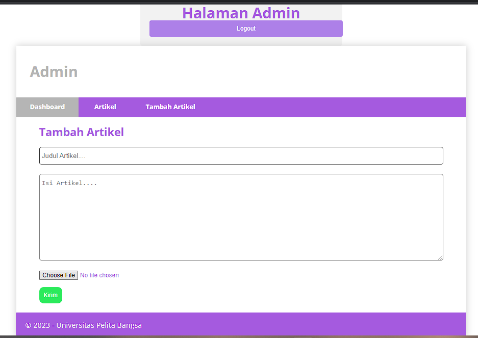
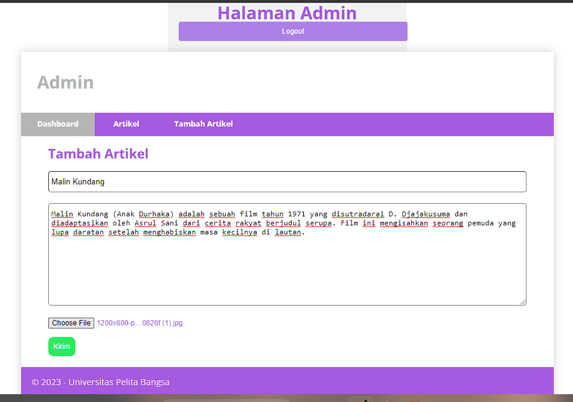
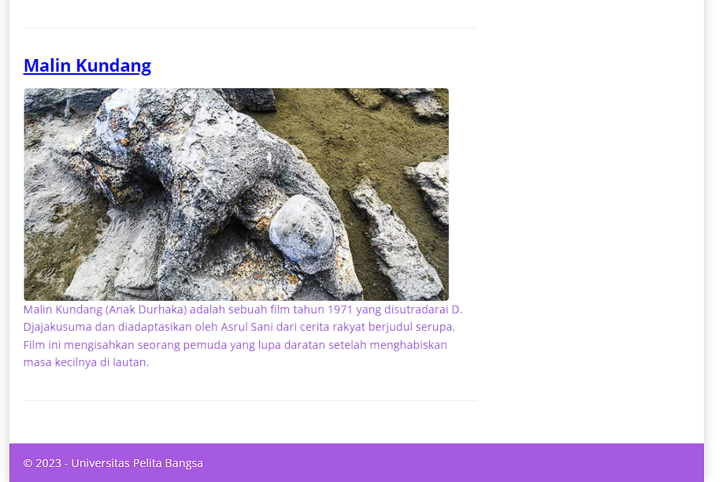

# Lab7Web-ImageFunction

# PHP-CodeIgniter

This project is an assignment from my class
#### NIM : 312110103
#### Kelas : TI.21.A2
#### MatKul : Pemrograman Web 2

### Menambah fungsi add image di Tambah Artikel

### Test Tambah Artikel

### Hasil

